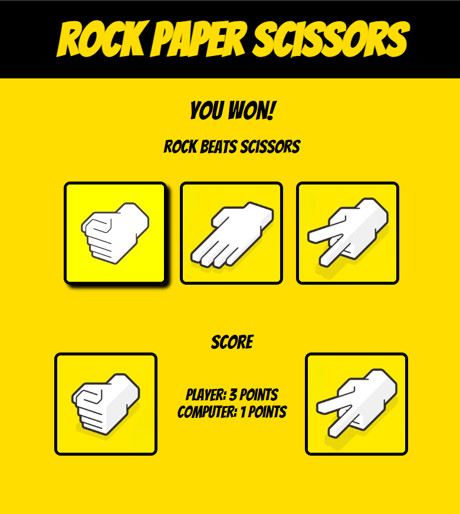

# Rock-Paper-Scissors
> Play against your computer.

[![NPM Version][npm-image]][npm-url]
[![Build Status][travis-image]][travis-url]
[![Downloads Stats][npm-downloads]][npm-url]

A website to play Rock Paper Scissors. Live site: [https://raphss.github.io/Rock-Paper-Scissors/](https://raphss.github.io/Rock-Paper-Scissors/)

Practice exercises from: [https://www.theodinproject.com](https://www.theodinproject.com)

<!-- Markdown link & img dfn's -->
[npm-image]: https://img.shields.io/npm/v/datadog-metrics.svg?style=flat-square
[npm-url]: https://npmjs.org/package/datadog-metrics
[npm-downloads]: https://img.shields.io/npm/dm/datadog-metrics.svg?style=flat-square
[travis-image]: https://img.shields.io/travis/dbader/node-datadog-metrics/master.svg?style=flat-square
[travis-url]: https://travis-ci.org/dbader/node-datadog-metrics
